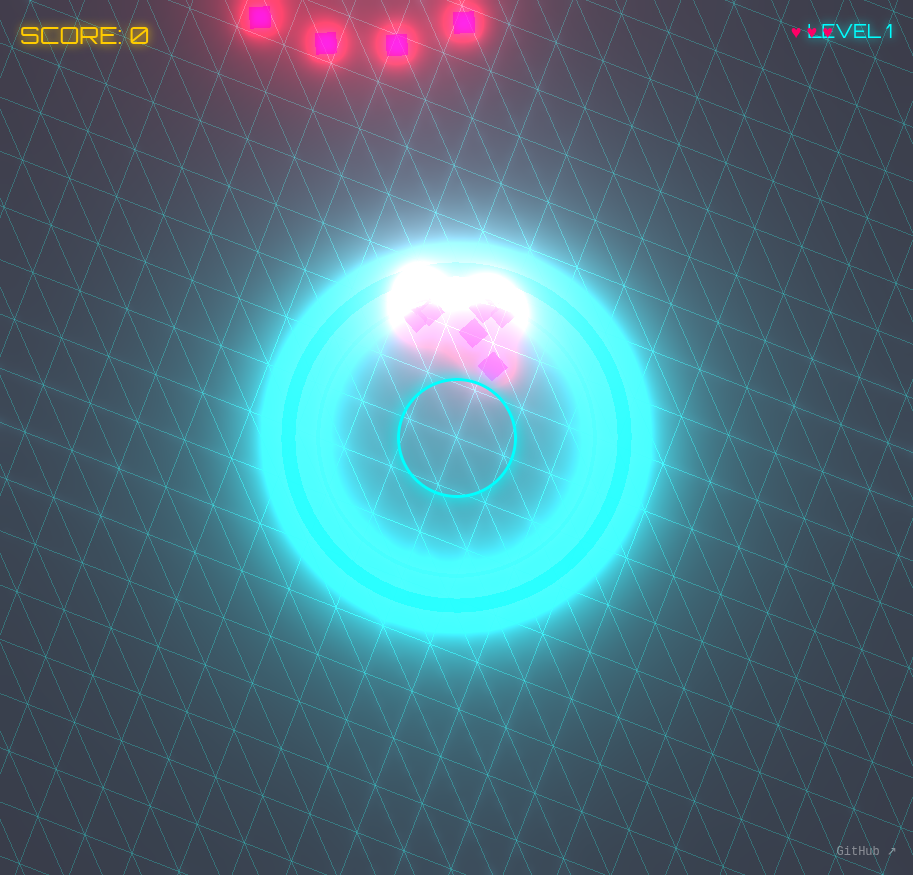

# Formation Break

The moment before the shatter.

Tap to unleash a shockwave that destroys enemy formations. Time your taps perfectly when the densest part of the formation passes over your targeting ring. Master the art of timing to achieve high scores!

## How to Play

- **Tap anywhere** to trigger a shockwave from your targeting ring
- **Time it right** when enemy formations pass over the center ring
- Formations can be **hollow** - only the edges score points!
- Watch out for **decoy clusters** that look dense but are empty in the center
- Miss 3 formations and it's game over
- Complete 5 levels to clear the grid

## Game Features

- 5 progressive levels with increasing difficulty
- Chain multipliers for consecutive hits
- Beautiful neon synthwave aesthetic
- Dynamic formations: squares, rings, and clusters
- Hollow formations and diagonal approach angles add challenge

## Built With
- [Three.js r183](https://threejs.org/)
- [Tone.js v15.1.22](https://tonejs.github.io/)

## Links
- **Play:** https://nishivector.github.io/formation-break/
- **Repo:** https://github.com/nishivector/formation-break
